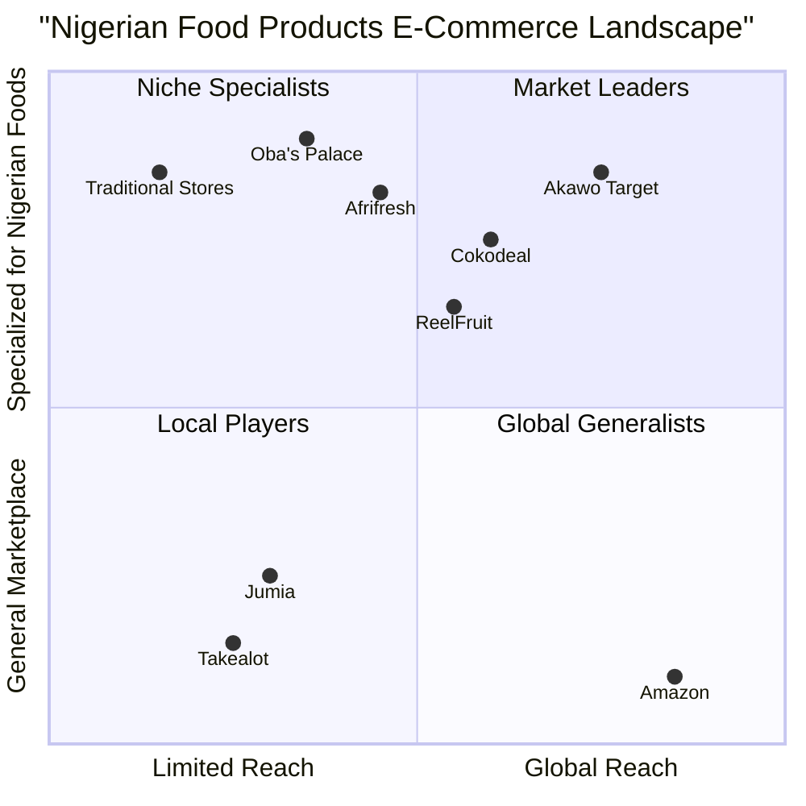

# Akawo: Mobile Commerce App PRD

## 1. Product Overview

### 1.1 Introduction
Akawo is a mobile commerce application designed for Africans in the diaspora to purchase Nigerian agro-products and processed foods. The app bridges the gap between Nigerian food producers and diaspora communities in the UK, US, and Europe, allowing users to access authentic Nigerian products from anywhere in the world.

### 1.2 Original Requirements
Design a mobile commerce app for Africans in the diaspora to purchase Nigerian agro-products and processed foods. The app should enable users to:

1. Browse and search products by category (e.g., grains, spices, snacks)
2. Filter products by location, price, and rating
3. Read product reviews and ratings
4. Place orders with secure payment options (e.g., PayPal, credit cards)
5. Track orders and shipments
6. Save favorite products and sellers
7. Receive notifications for promotions and new products

Features:

1. User registration and profile management
2. Product catalog with images, descriptions, and prices
3. Search and filtering functionality
4. Secure payment gateway integration
5. Order tracking and logistics integration
6. Push notifications and in-app messaging
7. Review and rating system

Technical requirements:

1. Develop using a suitable framework (e.g., React Native, Flutter)
2. Integrate with a reliable database (e.g., MongoDB, PostgreSQL)
3. Ensure secure payment processing (e.g., Stripe, PayPal API)
4. Optimize for performance and user experience

Target audience:

1. Africans in the diaspora (primarily in the UK, US, and Europe)
2. Nigerian agro-product sellers and manufacturers

App name: Akawo

## 2. Product Definition

### 2.1 Product Goals
1. **Bridge Cultural Gap**: Connect Africans in the diaspora with authentic Nigerian food products, preserving cultural identity and heritage through access to familiar foods.
2. **Empower Nigerian Producers**: Create a direct marketplace for Nigerian farmers, food processors, and vendors to reach global markets and increase their revenue opportunities.
3. **Streamline International Commerce**: Simplify the cross-border purchasing process by addressing logistics, payment, and regulatory challenges that typically hinder international food commerce.

### 2.2 User Stories
1. **As a Nigerian professional living in London**, I want to easily purchase authentic Nigerian spices and ingredients that I can't find in local stores, so that I can prepare traditional meals for my family.
2. **As a second-generation Nigerian American**, I want to discover and learn about traditional Nigerian food products, so that I can connect with my heritage through culinary experiences.
3. **As a Nigerian student in Germany**, I want to purchase affordable Nigerian snacks and staples with transparent shipping costs, so that I can enjoy tastes from home without breaking my budget.
4. **As a Nigerian food producer**, I want to showcase my products to diaspora markets, so that I can expand my business internationally and increase revenue.
5. **As a diaspora consumer planning a cultural event**, I want to bulk order Nigerian food products with reliable delivery dates, so that I can confidently prepare for my event without last-minute sourcing issues.

### 2.3 Competitive Analysis

#### Existing Solutions

1. **Afrifresh**
   - **Pros**: Established in the US market, 48-hour delivery in selected regions, focused on Nigerian products
   - **Cons**: Limited to specific US regions, mobile app interface reported as not optimized

2. **Cokodeal**
   - **Pros**: Export-focused with good business-to-business connections, partnerships with financial institutions
   - **Cons**: Less consumer-focused, complex user journey for individual buyers

3. **Oba's Palace Food and Varieties**
   - **Pros**: Authentic locally-sourced products, expanding international presence
   - **Cons**: Limited digital presence, slower shipping options

4. **ReelFruit**
   - **Pros**: Strong brand positioning for healthy snacks, established distribution channels
   - **Cons**: Limited product range (focused on dried fruits), not a full marketplace

5. **Jumia**
   - **Pros**: Pan-African reach, established logistics network, broad product categories
   - **Cons**: Not specialized for diaspora needs, limited international shipping options

6. **Takealot**
   - **Pros**: Strong South African presence, efficient delivery services
   - **Cons**: Limited Nigerian product range, focused primarily on South African market

7. **Traditional African Grocery Stores (physical)**
   - **Pros**: Personal touch, community hubs, immediate product availability
   - **Cons**: Limited selection, higher prices due to multiple intermediaries, inconvenient locations

### 2.4 Competitive Quadrant Chart

## 3. Technical Specifications

### 3.1 Requirements Analysis

Based on market research and competitive analysis, Akawo needs to address key challenges in the African diaspora food e-commerce space:

1. **Trust and Authenticity**: Diaspora consumers need assurance they are getting genuine Nigerian products.
2. **Cross-Border Commerce**: International shipping, customs, and regulations create complexity.
3. **Payment Friction**: International transactions can be expensive and complicated.
4. **Discovery Challenge**: New generations may not know what products to look for.
5. **Price Sensitivity**: Diaspora consumers compare prices with local alternatives.
6. **Cultural Connection**: The app must feel culturally relevant while being accessible.
7. **Logistics Visibility**: Users need transparency about where products are and when they will arrive.
8. **Market Fragmentation**: Connecting diverse suppliers with scattered diaspora communities.

### 3.2 Requirements Pool

#### P0 (Must-Have) Requirements
1. **User Account Management**
   - User registration and login with email/social options
   - Profile management with shipping addresses
   - Order history and tracking

2. **Product Catalog**
   - Category-based browsing (grains, spices, snacks, etc.)
   - Product listings with images, descriptions, and prices
   - Origin information for products
   - Stock availability indicators

3. **Search and Filtering**
   - Text-based search with auto-suggestions
   - Filtering by category, price range, rating, and location
   - Sort options (price, popularity, etc.)

4. **Shopping Experience**
   - Shopping cart functionality
   - Checkout process with address selection
   - Order confirmation and receipts

5. **Payment Processing**
   - Multiple payment methods (credit/debit cards, PayPal, etc.)
   - Secure payment processing
   - Price display in multiple currencies

6. **Order Management**
   - Order tracking with status updates
   - Shipping information and estimated arrival times
   - Order cancellation options

7. **Basic User Support**
   - FAQ section
   - Contact support feature
   - Return/refund policy information

#### P1 (Should-Have) Requirements

1. **Enhanced User Experience**
   - Favorites/wishlist functionality
   - Product recommendations
   - Recently viewed products
   - Save payment methods securely

2. **Social Features**
   - Product ratings and reviews
   - Ability to share products on social media
   - Refer-a-friend program

3. **Notifications**
   - Push notifications for order status updates
   - Alerts for promotions and new products
   - Stock alerts for favorite products

4. **Seller Profiles**
   - Information about product sellers/producers
   - Seller ratings and reviews
   - Direct messaging to sellers

5. **Enhanced Logistics**
   - Multiple shipping options
   - Customs and import fee calculator
   - Consolidated shipping for multiple items

#### P2 (Nice-to-Have) Requirements

1. **Advanced Features**
   - Loyalty program
   - Gift cards and gifting options
   - Bundle deals and discounts
   - Subscription options for regular purchases

2. **Cultural Integration**
   - Recipe suggestions using available products
   - Cultural calendar with special promotions
   - Educational content about Nigerian cuisine
   - Product stories and heritage information

3. **Community Building**
   - User-generated content
   - Community forum/discussion
   - Virtual events and cooking classes

4. **Advanced Technology**
   - Augmented reality product visualization
   - Voice search capability
   - Offline mode for basic browsing
   - Multi-language support

### 3.3 UI Design Draft

#### Key Screens

1. **Onboarding & Authentication**
   - Splash screen with app logo and tagline
   - Registration/login options
   - Welcome tutorial for first-time users

2. **Home Screen**
   - Featured products carousel
   - Category navigation tiles
   - Promotions and deals section
   - Search bar with voice input option
   - Recently viewed products

3. **Category/Search Results**
   - Grid/list view toggle
   - Filter and sort options
   - Quick add-to-cart functionality
   - Pagination or infinite scroll

4. **Product Detail**
   - Image gallery with zoom option
   - Complete product information
   - Price and shipping information
   - Quantity selector
   - Add to cart/wishlist buttons
   - Reviews and ratings section
   - Related products

5. **Shopping Cart & Checkout**
   - Cart summary with product images
   - Quantity adjustments
   - Shipping options and costs
   - Payment method selection
   - Order review step
   - Confirmation screen

6. **Account & Orders**
   - Profile settings
   - Saved addresses
   - Payment methods
   - Order history and tracking
   - Wishlist/favorites
   - Support access

7. **Notifications**
   - Notification center
   - Preference settings

8. **Seller Profiles**
   - Seller information and story
   - Product catalog from seller
   - Ratings and reviews
   - Contact options

### 3.4 Open Questions

1. **Regulatory Compliance**
   - What are the specific food import regulations for each target market?
   - How will we handle different food safety certification requirements?
   - What customs documentation needs to be integrated into the platform?

2. **Logistics Partnerships**
   - Which shipping partners best serve our target markets?
   - How can we optimize shipping costs while maintaining reasonable delivery times?
   - What cold chain requirements exist for perishable Nigerian foods?

3. **Payment Processing**
   - Which payment processors offer the best rates for our specific cross-border transactions?
   - How should we handle currency conversion to provide transparency to users?
   - What fraud prevention measures are most relevant to our market?

4. **Marketplace Model**
   - Should we adopt a pure marketplace model or include inventory options?
   - How will quality control be managed across multiple vendors?
   - What commission structure makes the platform sustainable while remaining attractive to sellers?

5. **Technology Stack**
   - Should we prioritize React Native or Flutter for cross-platform development?
   - What analytics framework would best capture our unique user journey metrics?
   - How should we structure the database to optimize for international product searches?

## 4. Implementation Plan

### 4.1 Development Phases

#### Phase 1: MVP (3 months)
- Core user authentication and profile management
- Basic product catalog with categories and search
- Shopping cart and checkout functionality
- Payment processing (major credit cards and PayPal)
- Order tracking with basic status updates
- Essential user support features

#### Phase 2: Enhanced Features (3 months)
- Ratings and reviews system
- Favorites and wishlist functionality
- Push notifications for orders and promotions
- Seller profiles and direct messaging
- Enhanced logistics options and tracking

#### Phase 3: Advanced Features (ongoing)
- Loyalty program and referrals
- Community features and content
- Subscription options
- Additional payment methods
- Advanced analytics and personalization

### 4.2 Technology Stack Recommendation

- **Frontend**: React Native (for cross-platform efficiency with native performance)
- **Backend**: Node.js with Express
- **Database**: MongoDB (for flexibility with product catalogs)
- **Authentication**: Firebase Authentication
- **Payment Processing**: Stripe (primary), PayPal (secondary)
- **Cloud Services**: AWS for hosting and storage
- **Shipping & Logistics**: Shippo API for multi-carrier integration
- **Analytics**: Segment for data collection, Google Analytics for reporting
- **Push Notifications**: Firebase Cloud Messaging

### 4.3 Success Metrics

- **Acquisition**: App downloads, user registrations, conversion rate
- **Engagement**: Monthly active users, session duration, screens per session
- **Retention**: 1-day, 7-day, 30-day retention rates
- **Transaction**: Orders placed, average order value, repeat purchase rate
- **Satisfaction**: App store ratings, NPS score, customer service inquiries

## 5. Conclusion

The Akawo mobile commerce app aims to fill a critical gap in connecting Africans in the diaspora with authentic Nigerian food products. By focusing on user experience, product authenticity, and streamlined logistics, Akawo can differentiate itself in a growing market with significant demand but few specialized solutions.

Success depends on addressing the unique challenges of cross-border food commerce while providing a culturally relevant and trustworthy platform. By implementing the features detailed in this PRD in a phased approach, we can quickly deliver value to users while gathering feedback for continuous improvement.

With an estimated 17 million Nigerians living abroad and growing interest in African cuisine globally, Akawo is positioned to become the leading marketplace for Nigerian food products in diaspora markets.
